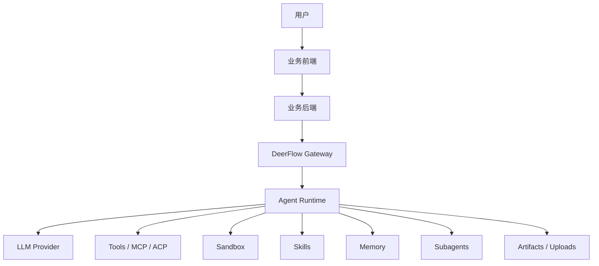

# DeerFlow 集成技术方案

本文给出一个可落地的方案：将 DeerFlow 作为 agent 底座，由你的业务后端统一编排和接入，前端只对接业务后端。

## 1. 目标

把 DeerFlow 作为独立的 agent runtime 服务使用，承载：

- 多轮对话
- 长任务规划
- 工具调用
- sandbox 执行
- skills 加载
- memory 注入
- 子代理协作
- 文件上传与产物展示

你的业务系统负责：

- 用户认证
- 权限控制
- 业务数据读取
- 业务对象和 DeerFlow thread 的映射
- 结果落库
- 审计、重试、限流、告警

## 2. 总体架构



推荐链路：

```text
业务前端 -> 业务后端 -> DeerFlow Gateway -> Agent Runtime
```

不要让普通业务前端直接裸连 DeerFlow 管理接口。

## 3. 分层职责

### 3.1 业务前端

- 展示对话、任务、报告、文件、产物
- 只调你的业务 API
- 不直接暴露 DeerFlow 管理面给普通用户

### 3.2 业务后端

- 用户认证和权限校验
- 业务对象读取
- prompt 组装
- 文件收集和上传
- thread_id 映射
- 调 DeerFlow runs API
- 转发 SSE 或等待最终结果
- 保存总结、工单备注、报告、日志

### 3.3 DeerFlow

- Agent 推理
- tool 调用
- sandbox 执行
- skills 加载
- memory 管理
- subagent 协作
- artifact 生成
- LangGraph thread/run 状态管理

## 4. 对接方式

### 4.1 核心聊天接口

流式执行：

```http
POST /api/langgraph/threads/{thread_id}/runs/stream
```

或者直连 Gateway：

```http
POST /api/threads/{thread_id}/runs/stream
```

同步等待：

```http
POST /api/threads/{thread_id}/runs/wait
```

取消运行：

```http
POST /api/threads/{thread_id}/runs/{run_id}/cancel
```

获取 run 消息：

```http
GET /api/threads/{thread_id}/runs/{run_id}/messages
```

### 4.2 辅助接口

- 模型列表：`GET /api/models`
- 文件上传：`POST /api/threads/{thread_id}/uploads`
- 产物读取：`GET /api/threads/{thread_id}/artifacts/...`
- 历史线程：`GET /api/threads/search`
- skills 管理：`GET/POST/PUT/DELETE /api/skills`
- MCP 配置：`GET/PUT /api/mcp/config`
- memory：`GET/POST/DELETE /api/memory`
- agents 管理：`GET/POST/PUT/DELETE /api/agents`

## 5. thread_id 设计

DeerFlow 用 `thread_id` 表示一条可持续恢复的对话/任务线程。你的业务系统需要定义自己的映射策略。

### 5.1 常见策略

| 策略 | 适用场景 |
| --- | --- |
| 一个用户会话一个 thread | 普通聊天助手 |
| 一个业务对象一个 thread | 工单、订单、项目、客户分析 |
| 一个任务执行一个 thread | 一次性自动化任务 |

### 5.2 推荐做法

正式系统建议数据库映射：

```text
business_type -> business_id -> user_id -> deerflow_thread_id
```

也可以直接用命名规则：

```text
ticket-12345
order-7788
project-p1001
```

但前提是 thread_id 必须满足 DeerFlow 规则：

- 只允许字母、数字、短横线、下划线

## 6. 运行上下文

调用 run 时，通过 `context` 控制 agent 运行模式。

常用字段：

| 字段 | 作用 |
| --- | --- |
| `model_name` | 指定模型 |
| `thinking_enabled` | 是否开启 thinking |
| `reasoning_effort` | reasoning 强度 |
| `is_plan_mode` | 是否启用计划模式 |
| `subagent_enabled` | 是否启用子代理 |
| `max_concurrent_subagents` | 单轮子代理上限 |
| `agent_name` | 使用自定义 agent |
| `is_bootstrap` | 是否进入 bootstrap 创建流程 |

示例：

```json
{
  "context": {
    "model_name": "custom-claude",
    "thinking_enabled": true,
    "is_plan_mode": true,
    "subagent_enabled": false,
    "reasoning_effort": "medium"
  }
}
```

## 7. 典型业务流程

以“工单分析”为例：

1. 用户在前端点击“分析工单 12345”
2. 业务后端校验权限
3. 后端读取工单详情、历史评论、附件
4. 查找或创建对应的 DeerFlow `thread_id`
5. 将业务数据整理为用户消息或文件
6. 调用 DeerFlow `runs/stream`
7. DeerFlow 在 sandbox 中调用工具、搜索、写文件、生成报告
8. 业务后端转发 SSE 给前端
9. 任务完成后把摘要、报告、产物写回业务系统

## 8. 文件与产物

### 8.1 上传

上传路径：

```http
POST /api/threads/{thread_id}/uploads
```

用途：

- 用户上传附件
- 业务后端预处理文件
- agent 读取上传内容

### 8.2 产物

agent 生成文件后，通常落在：

```text
/mnt/user-data/outputs
```

并通过 `present_files` 工具展示给前端。

业务后端可以再把这些产物同步到自己的对象存储、知识库或工单系统。

## 9. 鉴权与安全

### 9.1 推荐模式

推荐：

```text
业务前端 -> 业务后端 -> DeerFlow
```

普通业务前端不直接访问 DeerFlow 管理面。

### 9.2 如果前端直接连 DeerFlow

只有在你做 DeerFlow 管理台或内部工作台时才建议这样做。此时需要：

- 登录 cookie
- `credentials: "include"`
- `X-CSRF-Token`
- CORS 配置
- SSE 代理 buffering 关闭

### 9.3 管理接口默认关闭

自定义 Agent 管理 API 默认关闭：

```yaml
agents_api:
  enabled: false
```

开启后才会暴露：

- `/api/agents`
- `/api/agents/{name}`
- `/api/user-profile`

## 10. 数据模型建议

### 10.1 thread 映射表

```sql
CREATE TABLE ai_thread_mapping (
  id BIGSERIAL PRIMARY KEY,
  business_type VARCHAR(64) NOT NULL,
  business_id VARCHAR(128) NOT NULL,
  user_id VARCHAR(128) NOT NULL,
  deerflow_thread_id VARCHAR(128) NOT NULL,
  created_at TIMESTAMP NOT NULL,
  updated_at TIMESTAMP NOT NULL,
  UNIQUE (business_type, business_id, user_id)
);
```

### 10.2 run 记录表

```sql
CREATE TABLE ai_run_log (
  id BIGSERIAL PRIMARY KEY,
  business_type VARCHAR(64) NOT NULL,
  business_id VARCHAR(128) NOT NULL,
  thread_id VARCHAR(128) NOT NULL,
  run_id VARCHAR(128) NOT NULL,
  model_name VARCHAR(128),
  status VARCHAR(32) NOT NULL,
  summary ტექxt,
  created_at TIMESTAMP NOT NULL,
  updated_at TIMESTAMP NOT NULL
);
```

### 10.3 附件表

```sql
CREATE TABLE ai_attachment (
  id BIGSERIAL PRIMARY KEY,
  business_type VARCHAR(64) NOT NULL,
  business_id VARCHAR(128) NOT NULL,
  thread_id VARCHAR(128) NOT NULL,
  filename VARCHAR(255) NOT NULL,
  storage_url TEXT NOT NULL,
  created_at TIMESTAMP NOT NULL
);
```

## 11. 部署建议

### 11.1 个人/内测

```text
8 vCPU
16 GB RAM
100 GB SSD
SQLite
GATEWAY_WORKERS=1
```

### 11.2 正式生产

```text
16 vCPU+
32 GB RAM+
200 GB SSD+
Postgres
GATEWAY_WORKERS=2-4
```

### 11.3 运行事件存储

个人/内测可用：

```yaml
run_events:
  backend: jsonl
```

正式生产推荐：

```yaml
run_events:
  backend: db
```

## 12. 前端接入建议

### 12.1 最小功能

1. 创建 thread
2. 发送消息
3. 读取 SSE
4. 停止运行
5. 文件上传
6. 产物展示
7. 模型选择

### 12.2 前端不建议直接暴露

- `/api/skills`
- `/api/mcp/config`
- `/api/agents`
- `/api/memory`

这些更适合管理员后台或部署时配置。

## 13. 业务后端实现建议

### 13.1 推荐职责

业务后端负责：

- `/api/ai/chat`
- `/api/ai/tickets/{id}/analyze`
- `/api/ai/projects/{id}/summarize`
- `/api/ai/files/upload`
- `/api/ai/runs/{id}/stop`

内部再调用 DeerFlow。

### 13.2 调用模式

```text
业务前端
  -> 业务后端
    -> DeerFlow /api/langgraph/threads/{thread_id}/runs/stream
```

### 13.3 SSE 转发

业务后端可以：

- 原样转发 DeerFlow SSE
- 或把 SSE 转成你自己的事件协议
- 或在完成后只返回最终结果

## 14. 实施顺序

建议按这个顺序落地：

1. 跑通 `/api/models`
2. 跑通最小 `runs/stream`
3. 做 thread_id 映射
4. 接 SSE 到业务前端
5. 加上传和 artifact
6. 加结果落库
7. 加历史会话
8. 加模型切换
9. 再做 skills/MCP/agents 管理后台

## 15. 推荐结论

如果你的目标是“把 DeerFlow 当成业务中的 agent 底座”，推荐采用：

```text
业务前端
  -> 业务后端
     -> DeerFlow Gateway
```

如果你的目标是“直接做一个 DeerFlow 工作台或管理台”，可以让前端直接连 DeerFlow Gateway，但需要做好登录、CSRF、权限和代理配置。

